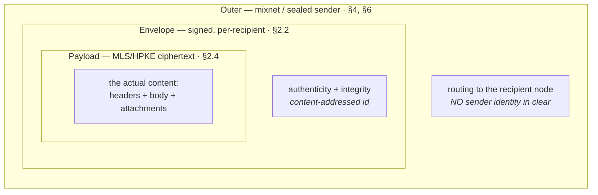

# 2. The MOTE Object

A **MOTE** (the atomic unit of DMTAP) is a signed, encrypted, content-addressed message
object. Mail, chat messages, file-share announcements, group events, and identity
announcements are all MOTEs — one format, rendered differently by clients (§5, §8).

## 2.1 Layered structure

A MOTE has three nested layers, each serving a distinct purpose:



The **outer** layer is what mix nodes and relays see: an onion-wrapped, constant-length
(padded) packet with no clear-text sender (sealed sender, §6). The **envelope** provides
authenticity to the recipient. The **payload** is the end-to-end-encrypted content.

## 2.2 Envelope (CBOR)

```
Envelope {
  v:        u8,             // format version (0)
  suite:    u8,             // algorithm suite (§1.1)
  id:       bytes,          // content address of `ciphertext` (§2.2, hash-agile)
  to:       DeliveryTag,    // routing target: recipient key, group id, or blinded tag (§2.2a)
  epoch:    ?bytes,         // MLS group epoch / group context ref, if group (§5)
  ts:       u64,            // sender timestamp (ms epoch)
  kind:     u8,             // message kind (§2.3)
  keypkg:   ?KeyPackageRef, // present iff this initiates an MLS session (async join, §5.3)
  challenge: ?ChallengeResponse, // anti-abuse proof for cold senders (§2.2b, §9) —
                                 //   verifiable WITHOUT decrypting `ciphertext`
  ciphertext: bytes,        // MLS or HPKE sealed Payload (§2.4)
  sender_key: bytes,        // EPHEMERAL per-message PUBLIC key; the verification key for
                            //   `sender_sig`. Fresh per message ⇒ unlinkable, reveals no identity.
  sender_sig: bytes,        // detached sig by `sender_key`'s secret over the §18.9.1
                            //   preimage; gates abuse, reveals no identity
}
```

- **`id`** — content address = a 1-byte **hash-algorithm prefix** (multihash-style, for
  agility) followed by the digest. v0 default is **BLAKE3-256** (128-bit collision resistance,
  equal to SHA-256; fast Merkle/XOF structure ideal for chunking). BLAKE3 is cryptographically
  sound but **not FIPS/IETF-standardized** (the IETF draft expired); the agility prefix lets an
  implementation migrate to SHA-256/SHA-3 where compliance requires it without changing the
  address format. Pin the exact BLAKE3 mode + 256-bit output. Content addressing gives
  deduplication, integrity, and cacheability for free; identical ciphertext shares an `id`.
- **Signature placement.** For sealed-sender messages the *authenticating* signature and the
  sender's identity live **inside** the encrypted payload (`Payload.from`, `Payload.sig`),
  so intermediaries never see who signed. `sender_sig` in the envelope is a
  detached signature by an *ephemeral* per-message key (unlinkable) used only for
  spam/abuse gating at the recipient (§9); it does not reveal identity. The matching
  **public** key travels in `sender_key` so the recipient can verify `sender_sig`
  *before decrypting* (§2.7 step 3) — there is no persistent key to look up, and a fresh
  keypair per message means `sender_key` is itself unlinkable. The `challenge` proof
  (§9) MUST be bound to `sender_key` (an ARC token is issued to it; a PoW/stamp commits to
  it — §9.4) so that a captured proof cannot be re-signed onto another envelope with a
  different ephemeral key.
- **`epoch`** ties a message to an MLS group epoch so the recipient selects the right key.

### 2.2a Delivery tag (`to`) and recipient blinding

`to` is a **`DeliveryTag`**, one of:

- the recipient's **identity key** — the **first-contact** form, simplest, and the only option
  before a per-contact secret exists. It carries **no sender information** (it is the recipient's
  own key), so an envelope bearing it is always classified **cold** at §2.7 step 5; a known contact
  MUST move to a blinded tag; or
- a **group id** (for MLS group messages, §5); or
- a **blinded delivery tag** — a per-contact value `BT = HKDF(shared_secret, epoch_day)` derived
  from a secret established at first contact (`epoch_day` is the **day-counter epoch**, §0.8 —
  distinct from an MLS group epoch or a mix-key epoch), which the recipient's node recognizes but
  which is **unlinkable across time and across observers** to the recipient's persistent key.

Blinded tags are RECOMMENDED for the `private` tier. **Honest limit (reconciled with §6.4):**
even a blinded tag does not hide *that a packet was delivered to a particular node* from the
final mix / an observer of the recipient's link — an always-on node has a stable network
presence (§6.4). Blinding removes the *persistent-key* linkage in the envelope; it does not
remove last-hop delivery observability, which §6.4 addresses with node/identity decoupling and
recipient-side cover traffic. Implementations MUST NOT present blinded tags as full recipient
anonymity.

### 2.2b Anti-abuse challenge (`challenge`)

`challenge` is an optional `ChallengeResponse` carrying the sender's proof for cold contact
(§9): an **ARC token**, a **proof-of-work solution**, a **postage stamp**, or a **vouch**. It is
placed in the *envelope* (not the payload) so the recipient can evaluate abuse policy **without
decrypting** — see the validation order in §2.7. Known contacts omit it (their MOTEs are
accepted on the fast path). See §9 for the grammar, issuer-trust rules, and each proof type.

## 2.3 Message kinds

```
0x00  mail            long-form message (email semantics)
0x01  chat            short message (chat semantics)
0x02  reaction        emoji/ack on a referenced MOTE
0x03  edit            supersede a referenced MOTE
0x04  redact          request deletion of a referenced MOTE
0x05  file_offer      manifest + key for a content-addressed file (§5.5)
0x06  group_event     MLS handshake / membership change (§5.3)
0x07  receipt         delivery/read receipt (opt-in; §6)
0x08  presence        ephemeral presence/typing (opt-in, off by default; §6)
0x09  identity        Identity/Move/RecoveryPolicy announcement (§1)
0x0a  system          protocol control (capability negotiation, §10)
0x0b  deniable        optional deniable 1:1 transport frame (§5.2.1); real content kind rides inside
0x40–0x7f  reserved for extensions (§10)
```

`0x40 pub_announce` is allocated from the extension range to the DMTAP-PUB extension (§22): a
public signed announcement, plaintext, openly signed by the publisher identity (no sealed
sender). Unlike the kinds above, a `pub_announce` is a **bare signed object, not a MOTE** — it
never rides inside an `Envelope`; it is fetched by content address (§22.3).

**Unknown kinds (normative).** A recipient MUST NOT `ack` a kind it does not implement.
Unknown kinds — unassigned, or assigned but unimplemented — are **ignored** (not surfaced, not
acked, MAY be discarded or held), never rejected as malformed (§21.16, §2.7 unknown-kind gate).

Kinds `mail` and `chat` differ only in default client rendering and default privacy tier
(§6): `mail` defaults to the `private` tier, `chat` MAY use the `fast` tier when both
parties are online. Both are the same object over the same transport.

## 2.4 Payload (CBOR, encrypted)

The plaintext that is sealed into `Envelope.ciphertext`:

```
Payload {
  from:     bytes,          // sender identity key (IK) — revealed only to the recipient
  sig:      bytes,          // IK (or device key) over the canonical payload hash
  headers:  Headers,
  body:     Body,
  refs:     [* bytes],      // ids of MOTEs this replies to / references (threading)
  attach:   [* Attachment], // §2.5
  expires:  ?u64,           // requested expiry (client-enforced deletion)
  provenance: ?[+ GatewayAttestation],  // sealed gateway-attestation chain (§7.8, §18.3.11);
                            //   present iff gateway-touched, absent ⇒ provably pure-mesh
}

Headers {
  thread:    ?bytes,        // stable thread/conversation id
  subject:   ?tstr,         // mail only
  mime:      ?tstr,         // content type of `body`
  cc:        [* bytes],     // additional recipient keys (fan-out is per-recipient MOTEs)
  ext:       { * tstr => ext-value },  // extension headers (§10); typed, NOT `any` — see §18.3.6
  sensitive: ?bool,         // key 6: no-persist / ephemeral-view (§6.7); §18.3.6 is authoritative
}

Body = tstr / bytes         // text or opaque MIME
```

Only the recipient (or group members) can decrypt `Payload`, so **all sender identity,
subject, recipients, threading, and content are hidden from the network** — this is what
sealed sender + payload encryption buys.

**`fs_ratchet` is removed (was: `?bytes`, "forward-secrecy ratchet material," §5.2).** An
adversarial audit found the field OPTIONAL, opaque, and — searched across the whole
specification — never given a preimage, a derivation, a verifier obligation, or any interpreter
at all. An undefined field that gestures at "forward secrecy" is worse than no field: it invites
an implementer to believe FS is handled somewhere they have not looked, for exactly the messages
(HPKE-sealed 1:1/first-contact MOTEs) that the honest disclosure now added at §5.2 and §6.9 SP-6
says carry none. Rather than retrofit real ratchet semantics onto a field that would either (a)
duplicate the already-specified MLS epoch mechanism (§5.1) for an established group, where it
would be redundant, or (b) reintroduce, for the bootstrap HPKE-to-KeyPackage-key message, exactly
the second per-message ratchet protocol DMTAP deliberately declined to build outside the optional
deniable mode (§5.2.1) — the field is deleted and the gap it papered over is disclosed as a gap
instead (§5.2, §6.9 SP-6). **§18.3.5's `Payload` CDDL carries the corresponding key (8,
`fs_ratchet`) and needs the matching removal (or an explicit `Reserved — do not assign` marking
if the key number must not be reused); reported to the §18 owner.**

## 2.5 Attachments and files

Small attachments MAY be inlined into `Payload.attach`. Larger files MUST be referenced by a
content-addressed **manifest**; **normal-tier** chunks (≤ 4 MiB) transfer **via the mixnet**
like messages, **large-tier** chunks via the fast/onion bulk path (§4.5). This is what makes
DMTAP a file-share of arbitrary size (no protocol cap).

```
Attachment {
  name:     tstr,
  mime:     tstr,
  size:     u64,
  inline:   ?bytes,         // present iff small
  manifest: ?ManifestRef,   // present iff large (§5.5)
  key:      bytes,          // per-file content key (recipient decrypts chunks)
}

ManifestRef { id: bytes, size: u64, chunks: u32 }   // BLAKE3 Merkle-DAG root (§5.5)
```

The manifest lists chunk hashes (a BLAKE3 Merkle DAG). Chunks are fixed-size, individually
encrypted and content-addressed, enabling **resumable, parallel, swarmed, deduplicated**
transfer. Only the manifest + `key` travel in the (private) MOTE; the chunks travel per the
size tier below — normal-tier via the mixnet, large-tier direct (§4.5). See §5.5 for the full
file model.

**Metadata-privacy size tiers (normative threshold, reconciles §2.5 / §4.5 / §6.5).** These are
**metadata-privacy tiers** — they fix which *path* the bytes take and what an observer can
learn; the **durability tiers** of §5.5.1 (who holds the bytes, and for how long) are an
orthogonal axis. A file is handled by one of three paths, by size:

| Tier | Size | Path | Metadata privacy |
|------|------|------|------------------|
| **inline** | ≤ v0 **48 KiB** of content — the padded MOTE then rides the top bucket rung, 64 KiB = 32 Sphinx cells (§4.4.1/§16.3); the ≈ 12 kB difference is the PQ envelope | in `Attachment.inline`, inside the MOTE | full (rides the message's tier) |
| **normal** | > inline, ≤ 4 chunks (v0: ≤ 4 MiB) | manifest in MOTE; **chunks also routed via the mixnet** | full (like messages, §6.5) |
| **large** | > normal | manifest in MOTE; **chunks via the fast/onion bulk path** (§4.5) | weaker — Tor-class (§6.5) |

The v0 numeric thresholds (48 KiB / 4 MiB) are parameters (§16.4) and MAY be tuned;
the three-tier model is normative. This removes the earlier binary small/large ambiguity.
**Note on "inline" and the mixnet cell:** an inline payload is **not** a single mix packet — the
Sphinx cell is 2 KiB (§16.3), so a padded inline MOTE is a **whole number of 2 KiB cells** on the
**bucket ladder** {16, 64} KiB (§4.4.1) — i.e. 8 or 32 cells. The inline tier's ceiling is the
**top rung** (64 KiB, 32 cells), not one packet, and the ≤ 48 KiB content cap is that rung less
the envelope; only ladder sizes appear on the wire, so size still leaks nothing.
Note there is **no 2 KiB and no 8 KiB rung**: a conformant PQ envelope (suite `0x02`, §1.1)
carries *two* signatures and *two* public keys plus a KEM ciphertext, and so exceeds **11.9 kB**
before any body at all. §4.4.1 states that arithmetic in bytes; the floor is whatever it forces,
and is 16 KiB in v0.

## 2.6 Delivery semantics

```
deliver(outer_mote)   → recipient node receives, unwraps outer, verifies envelope,
                         decrypts payload, stores, and returns:
ack(id)               → recipient confirms receipt of MOTE `id`.
```

- **`ack(id)` transport (normative — signing is MUST, not an optional hardening).** An `ack` is a
  **small signed control MOTE** (kind `system`, §2.3) — or, on a live direct/`fast` connection, a
  transport-level ack over the same channel — carrying `id`, and it **MUST** be signed (§19.3.2:
  this was previously an OPTIONAL implementation hardening, which is corrected here) by a key
  currently authorized under the recipient's pinned identity: the `IK` itself, or a non-revoked
  `DeviceCert`-chained device key (§1.2) — the identical authorization test §5.6.1 already applies
  to cluster-sync peers. The sender's retry queue (§4.7) MUST verify this signature before
  transitioning to `ACKED` (§20.1); an unsigned, wrongly-signed, or unauthorized-key ack MUST be
  ignored — it is not delivery evidence. An `ack` **MUST travel at the same privacy tier as the
  MOTE it acknowledges** (a `private`-tier MOTE's ack MUST NOT be downgraded to `fast` for
  convenience — the same no-silent-downgrade discipline as §4.4.9). Acks are not themselves acked
  (no ack storm). See §19.3.2 for the CDDL this requires and the full rationale, and §6.9 SP-2 for
  the disclosed residual (a signature necessarily proves a *specific device* produced it — a
  stronger identity commitment than an unsigned event carried).
- **Durability = the sender's node retries** until `ack`, with exponential backoff and an
  `expires`-bounded deadline. The mixnet/relay holds nothing durably.
- **Deduplication.** A recipient re-acks only an `id` it has **previously acked** (a stored,
  inbox-delivered MOTE): such a redelivery is acked immediately without re-processing. An `id`
  held **only in the deferred requests area** (§2.7a) is NOT acked on redelivery — re-acking it
  would leak, to an unproven sender probing with a duplicate, exactly the existence confirmation
  the requests-area no-ack rule withholds.
- **Retry deadline when `expires` is absent.** When `expires` is absent, the retry deadline is
  the §16.1 default maximum retry lifetime; retry is always bounded.
- **Ordering.** MOTEs are not globally ordered; `ts` + `refs` + (for groups) the MLS group
  `epoch` provide causal/threading order. Clients MUST tolerate out-of-order and duplicate delivery.

## 2.7 Validation (recipient MUST)

Validation is ordered **cheapest-and-anonymous first**, so a flood of cold junk is rejected
*before* any expensive asymmetric decryption (a decryption-DoS defense). On receipt a node MUST,
in order:

1. Reject unknown `v`/`suite` (fail closed).
2. Verify `id` matches the content address of `ciphertext` (§2.2); drop on mismatch.
3. Verify `sender_sig` over the **§18.9.1 preimage** (DS-tagged; `to` as deterministic CBOR,
   `ts` as u64 big-endian, `kind` as one byte, absent `challenge` as `0xf6`) under
   **`sender_key`** — the ephemeral per-message public key carried in the same envelope (cheap;
   no decryption). Drop on failure.
   `sender_key` is trusted only as the abuse-gate key for *this* envelope; it asserts no identity
   (identity is authenticated later, inside `ciphertext`, at step 8). The `challenge` at step 6
   MUST be bound to `sender_key` (§9.4), so this step also fixes which ephemeral key the abuse
   proof was minted for.
3a. **Freshness (replay bound, normative).** Reject a MOTE whose `ts` (§2.2) is more than the
   **clock-skew tolerance** (§16.1, ±120 s) ahead of the receiver's clock, **or** more than the
   **durable seen-id horizon** (§16.10) in the past. Drop on failure — same disposition as step 3
   (no ack; a duplicate of an `id` already acked is still re-acked per §2.6, since that rule runs
   at step 9 and is unaffected by this step). Two conditions are checked, not one, because they
   defend against different things and a single symmetric window cannot serve both:
   - **Too far in the future** catches a broken or lying clock — the pre-existing, narrow ±120 s
     bound (`ERR_TIMESTAMP_OUT_OF_SKEW`, `0x020C`, already registered in §21 but, until this fix,
     never actually wired into this procedure — a MOTE could not fail a check the validation steps
     never performed).
   - **Too far in the past** catches replay of a captured, validly-signed MOTE **after** it has
     aged out of the node's dedup cache (§2.6) but is presented again with every other check —
     `sender_sig`, `Payload.sig`, decryption — still passing, because nothing before this fix
     bounded how old an accepted `ts` may be. This bound MUST NOT be the same ±120 s figure used
     for the future direction: `ts` is fixed at a MOTE's original construction and does **not**
     change across a sender's retries (§20.1 keeps the envelope `id` — and therefore, since
     `Payload.sig`'s preimage binds `ts`, §18.9.2, the `ts` itself — stable across every
     re-onion-wrap), so a 120 s past-bound would reject a message still legitimately retrying at
     hour 71 of its 72 h deadline (§16.1), or one delivered from a 20-day offline buffer
     (§16.6/§14.5) the moment it drains. The past bound MUST instead be **at least as large as**
     the longer of the retry deadline and the offline-buffer TTL — which is exactly what the
     durable seen-id horizon (§16.10, currently 20 days) already is. Using that one figure for
     both the freshness past-bound and the dedup-cache retention is the point: freshness and
     dedup lifetime become **the same bound**, not the three different figures (§16.1's "≥ 300 s"
     replay-cache retention, §16.10's 20-day durable seen-id horizon, and §2.6's dedup-by-
     previously-acked set, which as written has no upper bound at all) this specification
     previously carried for what is conceptually one cache. **§16.1 and §16.10 need reconciling
     into a single cited parameter for this purpose, and §18.3.1's claim that `ts` is "used only
     for ordering/expiry, never for correctness" needs amending — `ts` now also gates a
     correctness/security check. Both are reported to their owning sections, not made here.**
   - **Deniable-mode parity.** The deniable 1:1 mode's first-message replay defense (§5.2.1(a))
     already enforces an equivalent bound for `DeniableInit`. This step brings the **default**
     (non-deniable) path to parity; the default path previously had none at all.
4. **Resolve `to`** to this node (or a group it belongs to). If `to` does not resolve, drop.
5. **Classify the sender** by `to`/pinning state: a **known contact** (fast path) vs an
   **unknown/cold sender**.
   **What `to` can and cannot tell you (normative).** Classification happens *before* decryption —
   that ordering is the whole decryption-DoS defense — so the only relationship signal available is
   `to`. A **`BlindedTag`** identifies the sender, because it is derived from a per-contact secret
   established at first contact (§2.2a); a **`GroupTag`** identifies the group. A **`KeyTag` does
   not**: it is the *recipient's own* identity key, and `sender_key` is a fresh ephemeral (§2.2), so
   a `KeyTag` envelope carries **no sender information whatsoever** at step 5.
   Therefore: **a `KeyTag` envelope MUST be classified COLD**, and a sender that is a known contact
   of the recipient **MUST address it by `BlindedTag`** (or `GroupTag` for an established group)
   once one has been established. `KeyTag` is the **first-contact** form, not the steady-state one.
   Without this rule step 5 is unexecutable on the documented default: two mutually pinned contacts
   using `KeyTag` and omitting `challenge` (which §2.2b permits for known contacts) would be
   classified cold, deferred, never acked, and the sender's queue would expire at 72 h — while the
   only alternative reading, treating an unidentifiable sender as *known*, deletes the cold-sender
   gate entirely.
6. **For cold senders, enforce anti-abuse policy (§9) NOW, before decryption**, using the
   `challenge` field (ARC token / PoW / stamp / vouch) — all checkable without decrypting.
   Reject or defer per §9.2 / §2.7a if the challenge is absent or insufficient.
7. Decrypt `ciphertext` (MLS epoch key or HPKE to recipient key); drop on failure. **Deniable
   fork (`kind = 0x0b`, §5.2.1):** if the envelope `kind` is `0x0b`, the `ciphertext` is a
   `DeniableFrame` (§18.3.9), **not** an MLS/HPKE-sealed `Payload`. Decryption is the **Double
   Ratchet** decrypt (a `DeniableInit` first establishes the X3DH/PQXDH session; a `DeniableMessage`
   advances the ratchet); the plaintext is a `DeniablePayload` (§18.3.10). A decrypt/ratchet
   failure is `ERR_DENIABLE_RATCHET_AUTH_FAILED` (`0x040D`, drop/hold-for-resync), never an
   MLS/HPKE decrypt attempt.
8. **Authenticate the sender and bind the envelope context**, as ordered sub-steps:
   - **(a) Payload signature (normal path).** Verify `Payload.sig` under `Payload.from`; **on
     failure, discard silently and do not `ack`** (fail closed, matching steps 1–3).
   - **(b) Envelope-context binding.** The `Payload.sig` preimage **binds the envelope's `kind`,
     `ts`, and `to`** (§18.9.2): recompute it using the received `Envelope`'s `kind`/`ts`/`to`
     and **reject any MOTE whose envelope `kind`/`ts`/`to` differ from the signed context**
     (`ERR_ENVELOPE_CONTEXT_MISMATCH`, `0x0211`). This stops a re-emitter from re-minting the
     anyone-can-mint `sender_sig` (step 3) over an altered `kind`/`ts`/`to` — rewriting the
     timestamp/causal order, or relabeling `kind` to change rendering or force a silent
     decrypt-fail.
   - **(b2) Vouch subject binding.** If the accepted `challenge` at step 6 was a **vouch**
     (§9.2a, §9.7), verify that **`Payload.from` equals `VouchToken.subject`**; on mismatch,
     discard silently and do not `ack` (`ERR_VOUCH_SUBJECT_MISMATCH`, `0x0126`).
     **Why this is required.** Unlike an ARC token, a PoW solution or a postage stamp, a vouch
     cannot be bound to the envelope's ephemeral `sender_key` at mint time — the voucher cannot
     know a key the vouchee has not yet generated, and a cleartext proof-of-possession over
     `sender_key` would break sealed sender (§6.2). §9.2a previously concluded from this that a
     stolen vouch needs no binding, because "the message still fails identity authentication at
     step 8". **That conclusion was wrong.** Step 8(a) verifies `Payload.sig` under
     `Payload.from` — a field the *thief* chooses and signs with their own key, so it succeeds.
     A vouch travels in the **cleartext** envelope by construction (§9.2a), so anyone on path can
     lift one and present it as their own, obtaining the strongest standing in the protocol
     (§9.7 bypasses VDF/PoW/stamp entirely) at zero cost — in a tier §9.7 describes as the one an
     adversary "cannot buy with either compute or money". Binding the vouch to the *subject it
     names* is the only check that can close this, and it necessarily lands here, after
     decryption, because `from` is not visible before it.
   - **(c) Pin check.** Otherwise verify `from` matches the pinned identity for a known contact,
     or TOFU-pin on first contact (§3.4). For a cold sender whose `from` is now revealed,
     re-apply block/allow lists.
   - **(d) Deniable fork (`kind = 0x0b`).** A `DeniablePayload` carries **no** `sig` — the
     substitute authenticator is the **Double-Ratchet AEAD tag** (the shared-key MAC) already
     checked at step 7. The recipient verifies that tag *instead of* `Payload.sig` (sub-steps
     (a)–(b); the deniable path binds the envelope context inside the ratchet AD instead,
     §18.9.10), binds `DeniablePayload.from` to the X3DH-authenticated `IK` (matching the pinned
     identity, §3.4), and **MUST reject any `DeniablePayload` that carries a signature field**
     (`ERR_DENIABLE_SIGNATURE_PRESENT`, `0x040F`) — a present signature would defeat the mode.
   - **(e) Suite-ratchet check (last — requires the now-revealed sender identity).** Verify
     `Envelope.suite` is **not below** this contact's pinned suite high-water-mark (§1.3); a
     below-water-mark suite is a downgrade attempt → reject to the requests area with a security
     warning (`ERR_SUITE_DOWNGRADE`, §21.4), never accept. This check MUST occur here, not at
     step 1, because sealed sender hides the sender until decryption; a recipient that has
     retired a suite for *itself* MAY additionally reject that `Envelope.suite` at step 1 as its
     own floor.

   **Unknown-kind gate (between steps 8 and 9, normative).** If `Envelope.kind` is unassigned,
   or assigned but not implemented by this node, the node MUST NOT `ack` and MUST NOT surface
   the MOTE; it MAY discard it or hold it (e.g. pending an upgrade). A node MUST NOT
   store-and-ack a kind it cannot validate (§21.16 forward-compatibility rule, §10.1) — an ack
   asserts validated delivery, which is impossible for semantics the node cannot check.
9. Apply `expires`, `refs`, `kind` semantics; store; `ack`.

   **Same-author gate for `edit`/`redact` (normative).** For `kind = edit` (`0x03`) or
   `kind = redact` (`0x04`), apply the referenced supersede/delete **only if** this MOTE's
   `Payload.from` equals the `Payload.from` of **every** MOTE named in `refs`, **as the recipient
   itself stored it** (the check is against the recipient's own recorded authorship of the
   target — never a claim carried by the incoming `edit`/`redact` itself). A `refs` target this
   node does not hold cannot be checked and MUST be treated as a mismatch (fail closed, not fail
   open).
   On mismatch — including an unresolvable `refs` target — the node MUST NOT apply the
   edit/redaction, MUST NOT surface it as the named author's own retraction or revision, and MUST
   discard the incoming MOTE **silently, without `ack`** (`ERR_EDIT_REDACT_AUTHOR_MISMATCH`,
   proposed `0x0212`, §21 registration needed) — deliberately the **same** disposition regardless
   of which of the two triggering conditions applied, so the check cannot become an authorship or
   existence oracle against a `refs` target a prober does not already know is present. This
   mirrors the disposition of a forged `sender_sig` (step 3): the sender's own retry independently
   reaches `EXPIRED` (§16.1); no explicit rejection is returned.
   **Why this is needed.** Without it, `edit`/`redact` had no same-author rule anywhere: §5.4 said
   only that they "reference a prior MOTE by `id` via `refs`," and §5.6.4 makes a durable redact
   remove-wins and unresurrectable across the owner's whole device cluster. Composed, any
   correspondent — in a 1:1 or a group — could permanently delete or silently rewrite another
   party's message in *the recipient's own view*, with a validly signed MOTE of their own. §24.7's
   public-profile lineage got this right ("`supersedes` is strictly *same-identity* history"); the
   messaging path now matches it.
   **Group moderation is a distinct kind, never a relaxed `edit`/`redact` (normative).** Where a
   deployment wants an admin/moderator (§5.8.2) to remove another member's post from a group, that
   is a **moderation action** — a different `kind`, rendered to members as an operator/moderator
   removal, never as the original author's own edit or retraction. `edit`/`redact` are reserved
   for same-author supersede/delete and MUST NOT be repurposed for moderation.
   **`reaction` (`0x02`) is unaffected.** A reaction does not claim to be the referenced author's
   own act — it is the *reactor's* own annotation on someone else's message — so it carries no
   authorship claim to impersonate, and this gate binds `edit`/`redact` only.

Known contacts MAY skip step 6 (they are pre-authorized). Only known-contact MOTEs reach
decryption on the fast path; unknown senders must pass the anonymous abuse gate first.

**Dedup ordering (normative).** Deduplication by `id` (§2.6) runs **after** classification
(step 5), never before: a duplicate of a previously **acked** `id` is then re-acked immediately
without further processing, while a duplicate of an `id` held only in the deferred requests area
follows §2.7a unchanged — held, not acked. Running dedup earlier would let a duplicate probe
short-circuit the abuse gate and turn the ack itself into an existence oracle.

### 2.7a Outcome of a failed/absent challenge (normative)

To reconcile §2.7 and §9.2, the disposition is by *degree*:

- **Invalid or forged** `challenge`, or failed `sender_sig`/`id` → **discard silently**, no
  user-visible effect, do not `ack` (except a duplicate of a previously **acked** `id`, which is
  re-acked per §2.6; a duplicate of an `id` held only in the requests area is never acked).
- **Absent or below policy threshold** (a cold sender with no/weak proof) → **defer to a
  "requests" area** (not the inbox), rate-limited, never silently dropped and never surfaced as
  a normal message, and **not `ack`ed** (a deferred cold MOTE is durably held but no receipt is
  sent — acking would confirm the recipient's existence to an unproven sender and falsely signal
  *delivered*; the sender's own retry reaches `EXPIRED`, §16.1). Deferred MOTEs are held for the
  **requests-area retention period** (30 days, §16.5), then auto-cleaned. The user MAY promote the
  sender (which pins them as a contact). Ack is owed **only** for inbox delivery (§19.3.1 step 9).
- **Unverified because the recipient was over its verification budget** (§9.4's over-budget path)
  → held in the separate **unverified-deferral holding class** (§16.5): small, capped, and retained
  for **≤ 24 h**, not 30 days. It MUST NOT be mixed into the requests area and MUST NOT count as
  having satisfied the §9.7a floor, because nothing has been checked about it.

**"Never silently dropped" governs VERIFIED input; refusing UNVERIFIED input is a different act
(normative).** The rule above forbids discarding a well-formed cold MOTE whose proof the recipient
*has checked* and found sufficient. It does **not** oblige a recipient to store input it has not
verified and cannot afford to verify. Past the aggregate requests-area budget (§16.5) a recipient
**MAY refuse unverified cold MOTEs outright**.

The distinction is load-bearing, and conflating the two produced a real defect. §9.4 requires
deferral **without verifying** once the memory-hard verification budget is exhausted — a budget
scoped per delivering connection, which an attacker multiplies for free across mix exits and
relays. With no aggregate cap and no permission to refuse, that composed into an unbounded
**durable-storage denial of service**: saturate the budget, then send unlimited cold MOTEs
carrying **garbage** in `challenge`, performing no work whatsoever, and a conformant node was
obliged to hold every one of them for 30 days. The §9.11 claim that native mail needs no filter
rested on a requests area that was, in that state, an unauthenticated write channel. A node that
cannot refuse unverified bytes has no floor to defend — it has a mailbox anyone can fill.

Implementations MUST NOT deliver an unproven cold MOTE to the inbox, and MUST NOT silently
discard a well-formed-but-under-threshold one without the requests-area affordance.

## 2.8 Why this shape

- **Content-addressed** → dedup, integrity, caching, and file chunking all fall out of `id`.
- **Three layers** → clean separation of *routing privacy* (outer), *authenticity*
  (envelope), and *confidentiality* (payload).
- **Sealed sender** → the network sees ciphertext to an opaque destination and nothing else.
- **One object, many kinds** → mail, chat, files, groups, and identity share the format, so
  the transport, store, and crypto are built once (§5).
